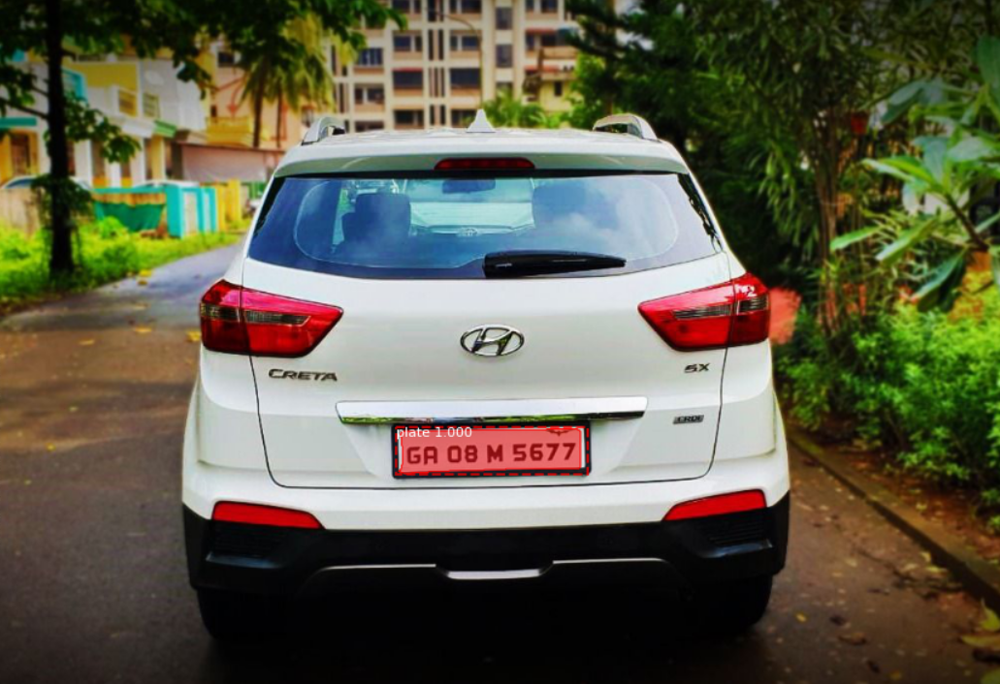
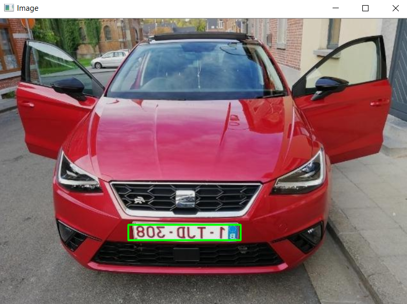
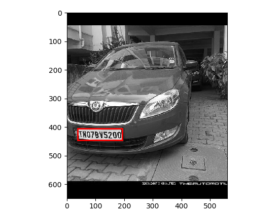
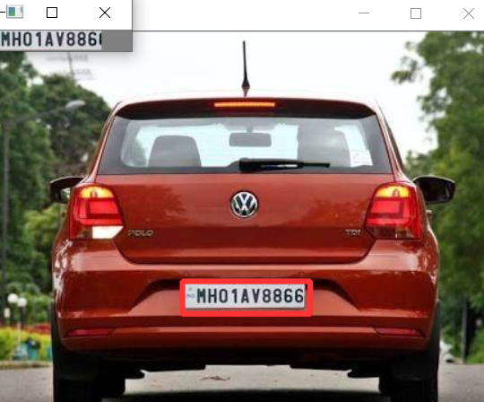

[![Issues][issues-shield]][issues-url]
[![LinkedIn][linkedin-shield]][linkedin-url]


<br />
<p align="center">
  <h3 align="center">Traffic Management</h3>

  <p align="center">
    License Plate Recognition and Speed detection using camera. 
    <br />
  </p>
</p>


<!-- TABLE OF CONTENTS -->
## Table of Contents

* [About the Project](#about-the-project)
* [Features](#Features)
* [Detection using Mask-RCNN](#Detection-using-Mask-RCNN)
* [Detection using Yolo](#Detection-using-Yolo-v3)
* [Detection using dimensions of number plate](#Detection-using-dimensions-of-number-plate)
* [Detection using Cascade features](#Detection-using-cascade-features)
* [OCR for license plate recognition](#OCR-model)
* [Speed Detection](#Speed-detection-using-cameras)


<!-- ABOUT THE PROJECT -->
## About The Project


Automatic number-plate recognition can be used to store the images captured by the cameras as well as the text from the license plate.

Here's why:
* Secure an area, such as a military base or research facility.
* Find a stolen vehicle or car involved in a crime.
* Monitor gated entrances & parking lot traffic.

We tested some best ways available for license plate detection.

### Features
* License plate detection
  * Yolo-v3
  * MasK-RCNN
  * Dimensions based
  * Cascade features
* Speed Detection
* Recognition using OCR


<br/>

### Detection using Mask-RCNN

Instance image segmentation

Results : <br/>


The Colab version for training and testing is provided [here](https://github.com/maheshmb13/Traffic-Management/blob/master/Detection%20using%20Mask-RCNN/maskmain.ipynb).

Model weights (mask_rcnn_plate_0134.h5) are available [here](https://github.com/maheshmb13/Traffic-Management/tree/master/Detection%20using%20Mask-RCNN).

**Training** <br/>
We collected over 400 images of indian cars with number plates. <br/>
Annotated using [VGG image annotator](https://www.robots.ox.ac.uk/~vgg/software/via/via-1.0.1.html)

**Advantages** <br/>
It classifies each and every pixel into pre-defined categories. This helps removing the edges of the number plate image which inturn helps in ocr recognition.

It gave good accuracy though the data is very low in number.

**Disadvantages** <br/>
Slow and not suitable for real time usage.


<br/>

### Detection using Yolo-v3

Single shot detection

Results : <br/>


The file for testing is provided [here](https://github.com/maheshmb13/Traffic-Management/blob/master/Detection%20using%20Yolo/detect.py).

Model weights (yolov3_1000.weights) are available [here](https://github.com/maheshmb13/Traffic-Management/tree/master/Detection%20using%20Yolo).

**Training** <br/>
Since we need around 2k images for better results, we did it for belgian cars dataset (around 1600 images) <br/>
Annotated using [Yolo-Annotation-Tool-New](https://github.com/ManivannanMurugavel/Yolo-Annotation-Tool-New-)

**Testing** <br/>
Using open-cv dnn and yolo weights got from the training process.

**Advantages** <br/>
Single shot detection. Speed and reliable.
It is suitable for real time usage.

It gave better results on training data. Coming to testing data it failed for some images. Though we provided very low dataset Mask-RCNN gave better results than yolo-v3 for small object detection (number plate).

**Disadvantages** <br/>
Needs a large dataset.


<br/>

### Detection using dimensions of number plate

We hard-coded the approximate dimensions of number plate. 

Results : <br/>


Click [here](https://github.com/maheshmb13/Traffic-Management/tree/master/Detection%20using%20dimensions) to navigate to the folder.

```sh
plate_dimensions = (0.03*label_image.shape[0], 0.08*label_image.shape[0], 0.15*label_image.shape[1], 0.3*label_image.shape[1])
plate_dimensions2 = (0.08*label_image.shape[0], 0.2*label_image.shape[0], 0.15*label_image.shape[1], 0.4*label_image.shape[1])
min_height, max_height, min_width, max_width = plate_dimensions
```

Range of dimensions are given. 

**Disadvantages** <br/>
It doesn't work in all conditions. Only a few set of angles work fine.


<br/>

### Detection using cascade features

Using haar-cascades.

Results : <br/>


Click [here](https://github.com/maheshmb13/Traffic-Management/tree/master/Licence%20Plate%20Recognition) to navigate to the folder.

The xml files are provided in the respective directory.
Use opencv cascade classifier for testing purpose

It gives good results but doesn't work in low light conditions. Works fine only with few conditions.

It is not as accurate as object detection using neural nets. Providing good balanced data (negative and positive samples) would give better results.


<br/>

### OCR model

Click [here](https://github.com/maheshmb13/Traffic-Management/tree/master/Licence%20Plate%20Recognition) to navigate to the folder. Model weights (ocrmodel.h5) are available in the directory.

We collected 9 images of each character from internet.

We created a basic CNN model using keras with categorical crossentropy loss. Trained it over the dataset (0-9 & A-Z characters).

Pre-processing of test data like character segmentation, finding contours etc. are provided [here](https://github.com/maheshmb13/Traffic-Management/tree/master/Licence%20Plate%20Recognition)

A jupyter version is also provided for training and testing.


<br/>

### Speed detection using cameras

We used haar cascades classifier for detecting cars in the video.

Each car is alloted with an id when it enters the camera view. The id is tracked till it moves out of the view using OpenCV. 

Speed is calculated using pixel per meter(ppm) which depends on camera angle. Here, we gave ppm as 8.4(approx.)

We assume camera to be static.


<!-- MARKDOWN LINKS & IMAGES -->
[linkedin-shield]: https://img.shields.io/badge/-LinkedIn-black.svg?style=flat-square&logo=linkedin&colorB=555
[linkedin-url]: https://linkedin.com/in/mahesh-babu-60641016a
[issues-url]: https://github.com/maheshmb13/Traffic-Management/issues
[issues-shield]: https://img.shields.io/github/issues/othneildrew/Best-README-Template.svg?style=flat-square


<hr/>

• ⚠️ This is a basic project and not useful for production. We followed many blogs and data is collected from kaggle, google images and some repos.
